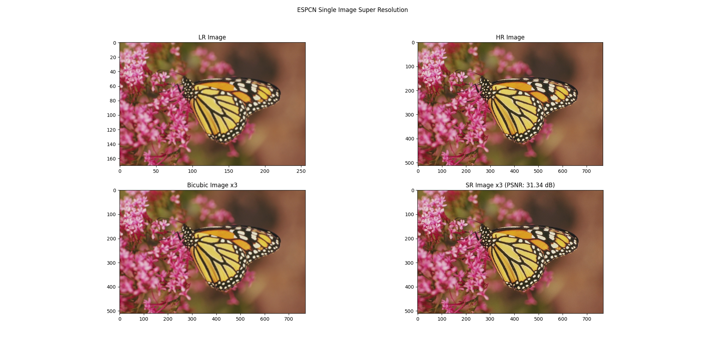

# Image_Super_Resolution_SoC

## Introduction

Image Super Resolution (SR) is a compelling area of research in image processing, focusing on enhancing the visual quality of low-resolution images. It finds great applications in medical imaging, satellite imaging, face recognition and surveillance. The Efficent Sub-Pixel Convolutional Network (ESPCN) is a powerful deep learning model specifically designed for SR tasks. This project explores the ESPCN model and its application in generating high-resolution images from low-resolution inputs.


## Implementation

This project aims at implementing the research paper [Real-Time Single Image and Video Super-Resolution Using an Efficient Sub-Pixel Convolutional Neural Network](https://arxiv.org/abs/1609.05158). 

The aim of SISR (Single Image Super Resolution) is to estimate a high resolution image ($I^{SR}$) given a low resolution image ($I^{HR}$) downscaled from the corresponding original HR image $I^{HR}$. The downsampling operation is deterministic and known: to produce $I^{LR}$ from $I^{HR}$, we first convolve $I^{HR}$ using a Gaussian filter, then downsample the image by the upscaling ratio r. 

In our project, to recover $I^{SR}$, a $l$ = 3 layer convolutional network is used. In our architecture, we first apply a 2 layer convolutional neural network directly to the LR image, and then apply a sub-pixel convolution layer that upscales the LR feature maps to produce $I^{SR}$.

We set $(f1,n1) = (5, 64), (f2,n2) = (3, 32)$ and $(f3,n3) = (3,C*r^2)$ in our code, where $f_i$ is the kernel size, $n_i$ is the number of features in th $i$-th layer of the CNN, $C$ is the number of channels in the image and $r$ is the upscaling factor.  The activation function is the $tanh()$ function.

In the training phase, $17r$ x $17r$ pixel sub-images are extracted from the training ground truth images $I^{HR}$ , where $r$ is the upscaling factor. To synthesize the low-resolution samples $I^{LR}$ , we blur $I^{HR}$ using a Gaussian filter and sub-sample it by the upscaling factor. The sub-images are extracted from original images with a stride of $(17- $&Sigma; $mod (f, 2))$ x $r$ from $I^{HR}$ and a stride of $17-$&Sigma; $mod (f, 2)$ from $I^{LR}$ . This ensures that all pixels in the original image appear once and only once as the ground truth of the training data.

## Setup

Please setup your training environemnt by installing the requirements using:
```
$ pip install -r requirements.txt
```

## Training the model

To train the model, use the following command:

```
python3 train.py -t ./dataset/train -v ./dataset/val -o ./assets/models/ -epochs 40
```

This will train the model and save the model's weights as `state_dict()` to the `assets/models/` folder.

## Testing the model

This repository comes with pre-trained model as well. To directly run inference on images, use the following command:

```
python3 infer.py -w ./assets/models/best.pth -i ./dataset/test/face.png -o ./assets/outputs/
```

The super-resolved image obtained from our model is stored to the `assets/outputs/` folder.

## Results

The following are some images comparing the original High Resolution image vs downscaled vs Image up-sampled using Bi-cubic up-sampling vs Super Resolution using this ESPCN model.
Note that the up-scaling factor for bi-cubic up-sampling and the super-resolution model is set to 3.



